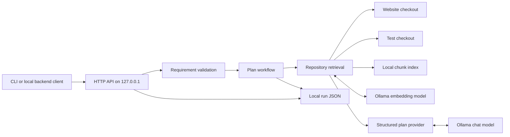

# Architecture

## Purpose and current boundary

This is a local planning backend. It reads two separately configured source repositories, retrieves relevant excerpts, asks a local model for a structured implementation plan, validates file references, and saves the run. It does not edit either repository or execute the proposed plan.

The arrows to both source repositories are reads. The local index and run directory are the only persistent outputs. Neither is intended for Git.

## Request path

1. `src/server.ts` accepts `POST /api/plans`, validates the JSON body, and allows one active plan request. `GET /api/runs/<id>` reads a saved run; `GET /health` reports service state.
2. `src/requirements/validate.ts` checks title, description, acceptance criteria, and optional pinned repository paths.
3. `src/workflows/plan.ts` saves a running record, collects context, calls the selected provider, and saves a completed or failed record.
4. `src/repositories/scan.ts` inventories eligible files without following symlinks. `index.ts` refreshes changed files as overlapping, line-numbered chunks with one embedding per chunk. The index is stored as JSON under `data/index/`.
5. `semantic-context.ts` combines semantic and lexical ranking, boosts imports and test relationships, honors pinned files, expands nearby lines, and selects excerpts within the configured token budget. `context.ts` also offers a simpler keyword-only mode.
6. `tokenizer.ts` counts Qwen model tokens locally. `providers/prompt.ts` builds the same messages used by `providers/ollama.ts`, reserving 1,800 tokens for output and 256 for template overhead inside `OLLAMA_NUM_CTX`.
7. `providers/ollama.ts` requests JSON-schema output from Ollama. `providers/schema.ts` rejects a plan if a proposed change points outside the supplied context. A rejected model response gets one retry.

`src/types.ts` defines the requirement, context, plan, and run contracts. `src/providers/mock.ts` supports the offline demo. `scripts/index.ts`, `scripts/setup-tokenizers.ts`, and `scripts/evaluate.ts` build the index, install pinned tokenizer assets, and measure retrieval and planning.

## Data and trust boundaries

| Data | Source | Destination | Git status |
| --- | --- | --- | --- |
| Requirement and pinned paths | API caller | Local workflow and saved run | Runs ignored |
| Source snippets and embeddings | Configured checkouts | Local Ollama, `data/index/`, `data/runs/` | Local data ignored |
| Tokenizer assets | Pinned Qwen model revisions | `data/tokenizer/` | Ignored; reproducible with `npm run setup:tokenizers` |
| Evaluation results and model plans | Three checked-in test cases | `data/evals/` | Reports ignored; cases checked in |
| Repository paths and model settings | Local `.env` | Process configuration | `.env` ignored; `.env.example` checked in |

Repository text is treated as untrusted model input. The planner is instructed to ignore instructions inside source files, and plan paths are checked against retrieved context. These checks establish where a suggestion came from; they do not prove that the suggestion is correct. The evaluation found plausible but unnecessary changes in both local models, so every plan needs source review.

The API listens only on `127.0.0.1`, rejects requests carrying an `Origin` header, and has no user authentication. Its saved runs contain source excerpts and its index contains repository paths and vectors. Do not expose this API or its data directories through a public server. The file inventory filters common credential filenames but cannot prove that ordinary source files contain no secrets.

## Operational limits

- The local JSON index is suitable for small checkouts, not multi-user concurrency or large monorepos.
- File refresh uses size and modification time; a repository can change while a request is running.
- Relationship detection uses imports, filenames, test selectors, and routes. It is heuristic and can miss dynamic or indirect dependencies.
- The local tokenizer estimate may differ slightly from Ollama's final prompt count. Compare the recorded estimate with `prompt_eval_count` in evaluation reports.
- The process allows one planning request at a time; runs are saved on the local filesystem.

See [ROADMAP.md](ROADMAP.md) for planned stages and [SECURITY.md](SECURITY.md) for the publication and deployment boundaries.
