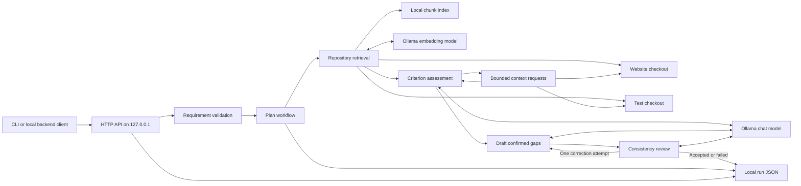

# Architecture

## Purpose and current boundary

This is a local planning backend. It reads two separately configured source repositories, retrieves relevant excerpts, asks a local model for a structured implementation plan, validates file references, and saves the run. It does not edit either repository or execute the proposed plan.

The arrows to both source repositories are reads. Indexes, runs, tokenizer assets, and source-bearing evaluation reports stay under ignored `data/`.

## Request path

1. `src/server.ts` accepts `POST /api/plans`, validates the JSON body, and allows one active plan request. `GET /api/runs/<id>` reads a saved run; `GET /health` reports service state.
2. `src/requirements/validate.ts` checks title, description, acceptance criteria, and optional pinned repository paths.
3. `src/workflows/plan.ts` saves a running record, collects context, calls the selected provider, and saves a completed or failed record.
4. `src/repositories/scan.ts` inventories eligible files without following symlinks. `profile.ts` parses JS/TS/JSX/TSX into deterministic facts with exact source ranges: imports, functions/classes, state, conditions, event bindings and selectors. It does not execute source or infer behavior. `chunks.ts` preserves complete syntax nodes within 2,400 characters, descends into oversized components, and packs adjacent nodes within the cap. Unsupported/malformed source and oversized leaves use overlapping text chunks. `index.ts` embeds bounded fact labels alongside the actual source and caches the profile and vectors. Index version 3 invalidates previous chunk caches. The index is stored as JSON under `data/index/`.
5. `semantic-context.ts` defaults to whole-requirement semantic/lexical ranking, with import/test boosts, pinned files and nearby lines. Experimental `RAG_RETRIEVAL_STRATEGY=criterion` embeds the whole requirement and each criterion in one batch. Selection version 2 first protects whole-requirement excerpts containing matching handlers, guards, state or referenced functions, plus pins. Leading files containing only imports/types/layout can receive a behavior excerpt from the same file; token space for other leading files is reserved. Criterion rankings combine their own scores, the whole-requirement score and a bounded syntax-fact preference, then share remaining space. Complete supplied chunks are included once. Both strategies retain limits of 12 excerpts, six per repository and two per file, with the same bounded follow-up inventory. Experimental metadata records `selectionVersion`, `anchors`, `criteria` and `sourceLinks`. `usage.ts` binds a single source file without resolving dependencies or executing code, distinguishing actual calls, JSX renders and event references from comments, strings and shadowed identifiers. Static exported functions can be linked across eligible imports. Dynamic imports, CommonJS, framework entry points and indirect calls can be missed; a missing link does not prove that code is unused. These links and rankings do not establish runtime behavior or semantic support. The strategy remains opt-in pending broader validation. `context.ts` also offers a keyword-only mode.
6. `tokenizer.ts` counts Qwen model tokens locally. `providers/evidence.ts` creates content-bound IDs for supplied source lines, splitting long lines into fragments of at most 500 characters. `prompt.ts` annotates source with IDs. Retrieval reserves 1,800 output tokens, 256 for template overhead, 256 for repairs, and 1,200 for later stage state. Every actual stage prompt is checked again before sending it.
7. `providers/stages.ts` defines assessment, draft and review contracts. The model assesses every criterion with exact text, evidence IDs and a private audit. Every selected ID needs one relevance/support check; resolved observations require checks marked direct and supporting. Each unknown criterion owns a source or policy question copied into the response questions. Pure policy uncertainty cannot request more source. The backend enforces consistency of these fields, resolves IDs into quotes/lines and derives the outcome; it does not independently prove the audit's semantic claims. Unknown criteria block drafting; fully implemented requirements finish after assessment. Audit details remain in private diagnostics, preserving public schema version 2.
8. Missing ranges use `expand-context.ts`: at most three eligible ranges of 120 lines, two expansion rounds, and the same token budget. Pins, previously requested ranges, and source around assessment citations are preserved before packing new ranges. If they cannot fit, the original context stays intact. `ranges.ts` merges adjacent supplied excerpts for coverage checks. The model sees supplied ranges, follow-up warnings and its previous assessment; an unknown assessment's redundant request permits one reassessment with feedback, then stops if still unresolved. Resolved assessments discard and record only already-supplied requests; pending requests for unseen source remain invalid. The model cannot read arbitrary paths.
9. Confirmed gaps enter drafting with fixed assessments. Unresolved questions require unknown assessments, and draft questions are rejected rather than allowing required decisions to be deferred. Audit payloads are omitted from the locked draft/review prompt to preserve space. Changes and scenarios are grouped by exact criterion number/text. Each edit retains evidence from its assessment and from the edited file. The model then reviews alignment, evidence support and risk claims, and checks execution and result for every exact draft scenario. Risk findings name actual draft risks; empty draft risks require empty findings. The backend independently rejects every failed scenario and any contradiction between scenario checks and the overall step/test flag. Those contradictions enter correction rather than consuming a structural repair. Findings permit one redraft and another review; a second negative review rejects the plan. `reviewAttempts` retains both attempts, including the model's original flags, and `consistencyFailures` accumulates model and backend findings. An all-clear model review remains fallible. The public result retains schema version 2 and passes `schema.ts` quote/path validation.
10. `providers/ollama.ts` permits one structural repair per stage. All stages, context expansions and repairs share one timeout. `planningMetrics` in saved runs records stage token counts, accepted assessment/draft/review responses, validation errors, consistency findings, and structurally rejected responses capped at 12,000 characters each. Evaluation retains the same diagnostics for failures. These records may contain external source and remain private under ignored `data/`.

On reassessment, experimental source-use hints can advertise up to three caller ranges from the bounded eligible inventory for previously cited definitions. Hints carry no evidence IDs and cannot serve as citations; the caller source must be supplied to support a claim. They are included only in follow-up prompts, whose actual token count is checked before inference.

`src/types.ts` defines the requirement, context, plan, and run contracts. `src/providers/mock.ts` supports the offline demo. `scripts/index.ts`, `scripts/setup-tokenizers.ts`, and `scripts/evaluate.ts` build the index, install pinned tokenizer assets, and measure retrieval and planning. `scripts/freeze-evals.ts` makes eligible source copies under ignored `data/eval-snapshots/` for stable comparisons; later edits to the originals cannot change those copies. Its manifest records the source roots, copied roots, and separate index directory.

The evaluation harness uses `providers/gpu-placement.ts` to preload the planner at the requested context and require full GPU placement before and after each stage. Its embedding adapter also checks placement before and after inference and unloads before planning. `/api/ps` must report a positive model size equal to `size_vram`; missing telemetry, CPU/mixed placement or a mismatched planner context blocks the case. Reports retain placement snapshots and hardware eligibility; summaries exclude hardware blocks from comparable plan attempts. This policy applies to evaluations; the HTTP planning path retains Ollama's automatic placement. CPU/RAM remain necessary for the surrounding backend and source processing.

## Data and trust boundaries

| Data | Source | Destination | Git status |
| --- | --- | --- | --- |
| Requirement and pinned paths | API caller | Local workflow and saved run | Runs ignored |
| Source snippets and embeddings | Configured checkouts | Local Ollama, `data/index/`, `data/runs/` | Local data ignored |
| Tokenizer assets | Pinned Qwen model revisions | `data/tokenizer/` | Ignored; reproducible with `npm run setup:tokenizers` |
| Evaluation results and model plans | 19 development cases and four reserved validation cases | `data/evals/` | Reports ignored; cases checked in |
| Repository paths and model settings | Local `.env` | Process configuration | `.env` ignored; `.env.example` checked in |

Repository text is treated as untrusted model input. The planner is instructed to ignore instructions inside source files, and paths and quotes are checked against retrieved context. These checks establish where a suggestion came from; they do not prove that its interpretation is correct. Per-criterion gold outcomes and line ranges are tied to source hashes in `evals/source-snapshot.json`; each new report retains the snapshot it used. Evaluation rejects sources that changed before a case and withholds correctness scores when they change during generation. Semantic claim scores remain unset until source review. Every plan still needs independent review before use.

The API listens only on `127.0.0.1`, rejects requests carrying an `Origin` header, and has no user authentication. Its saved runs contain source excerpts and its index contains repository paths and vectors. Do not expose this API or its data directories through a public server. The file inventory filters common credential filenames but cannot prove that ordinary source files contain no secrets.

## Operational limits

- The local JSON index is suitable for small checkouts, not multi-user concurrency or large monorepos.
- File refresh uses size and modification time; a repository can change while a request is running.
- Relationship detection uses imports, filenames, test selectors, and routes. It is heuristic and can miss dynamic or indirect dependencies.
- The local tokenizer estimate may differ slightly from Ollama's final prompt count. Compare the recorded estimate with `prompt_eval_count` in evaluation reports.
- The process allows one planning request at a time; runs are saved on the local filesystem.

See [ROADMAP.md](ROADMAP.md) for planned stages and [SECURITY.md](SECURITY.md) for the publication and deployment boundaries.
