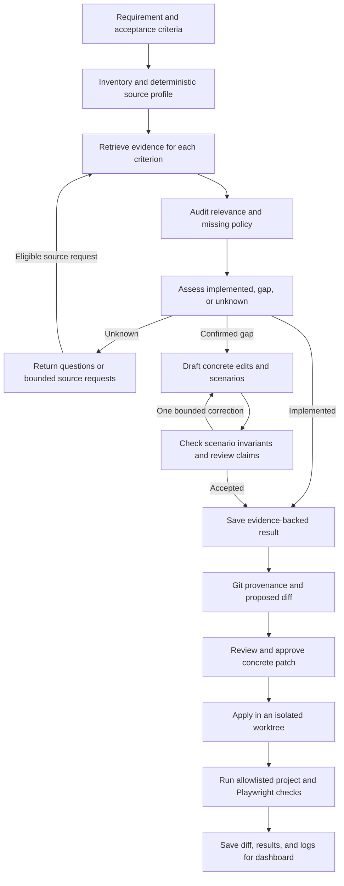

# Future workflow

Updated 2026-10-11. This is the implementation order for SpecPilot AI. The local backend currently produces plans; later patch and execution stages have separate acceptance gates.

The profiler-first approach and sequential roles draw on [TidySwarm](https://github.com/varun872/tidyswarm). Keep the existing TypeScript contracts and bounded stage calls. A new orchestration framework is not needed for this increment.

## Implementation order and gates

| Step | Status | Implementation and acceptance gate |
| --- | --- | --- |
| 1. Profile source and preserve structure | Implemented; three-case retrieval smoke passed | Parse JS/TS/JSX/TSX without executing it. Record exact ranges for imports, functions/classes, state, guards, event bindings and selectors. Keep syntax nodes together when they fit within 2,400 characters; descend into larger components. Unsupported or malformed source and oversized leaves use text chunks. Version 3 indexes invalidate old caches; frozen-copy cache reuse follows the same version. |
| 2. Measure retrieval separately | Nineteen-case comparison and four reserved cases measured; independent review pending | Matching-runtime development runs retain gold-line coverage at 0.669 with zero coverage regressions; file recall rises from 0.627 to 0.640. Reserved initial retrieval retains coverage at 0.915; live planning matches only 1/4 expected outcomes and rejects three audits. Keep the historical index and reports. Inspect actual handlers/state/guards, not just file recall. Reserved gold was authored before this increment by the implementing agent; independent held-out review remains open. |
| 3. Retrieve and audit each criterion | Anchored opt-in selection and private audit implemented; reliability gate open | Version 2 protects useful whole-requirement evidence, favors matching handlers/state/guards and referenced functions, then allocates remaining space across criteria. Saved anchors, nominations and syntactic call links support inspection. Whole-requirement selection remains the default. Each criterion audits its cited IDs and owns any source or policy uncertainty. Unknown criteria prevent drafting; policy-only questions cannot request source, and draft questions are rejected. Backend checks enforce self-audit consistency, not semantic truth. A helper definition alone does not prove UI integration, and missing policy cannot be supplied by ranking more code. |
| 4. Make scenario verification concrete | Model review exists; deterministic scenario contract planned | Represent starting state, guard, enabled action, operation and expected state as structured data. Apply supported deterministic checks to arithmetic and invariants; do not evaluate free-form model code. Use the source-reviewed quantity checklist as the first reference. Retain structured failure findings through the existing bounded correction loop. |
| 5. Establish reliable live plans | Open gate | Obtain a source-reviewed correct enhancement plan, handle ambiguous policy with questions, and measure independent held-out cases. Exact quotes and a positive model review alone do not satisfy this gate. |
| 6. Add Git provenance and diff review | Planned after step 5 | Capture commit IDs and dirty state for both repos, detect source changes, and generate a concrete patch tied to that source. Review before applying it. |
| 7. Isolated application and checks | Planned | Apply approved changes in worktrees/branches, select impacted tests, execute only allowlisted commands, and save exit codes and logs. Execution requires isolation and domain checks; an AST whitelist around in-process execution is insufficient. |
| 8. Dashboard and wider operation | Planned | Present evidence, questions, plan, diff, approvals and check results. Add authentication, jobs, retention and recovery before wider access. |

## Model comparison rules

Evaluation runs one selected planner at a time against the same source snapshots and criteria. Retrieval-only runs isolate retrieval quality from generation quality. Planning evaluations preload the requested model at the configured context size and check placement before and after every stage, including repair/correction calls. Embedding evaluations also check placement before and after inference, then release the embedding model before planning. Cleanup unloads evaluated models between cases.

The guard requires positive `size` and exact `size_vram === size`, matching [Ollama's `100% GPU` rule](https://github.com/ollama/ollama/blob/main/cmd/cmd.go). Missing, mixed or CPU placement blocks the evaluation. Hardware-blocked entries are reported separately and excluded from the plan-quality comparison denominator. Recorded `/api/ps` snapshots verify reported placement at those checks; total `nvidia-smi` memory includes other processes. The backend, parsing and tokenization still use CPU/system RAM. These guards apply to the evaluation harness; the normal HTTP planning path does not yet enforce them.

Historical 8B/9B runs did not enforce this rule. Logs showed full GPU placement for 8B and partial CPU offload for 9B, so their latency comparison is not a controlled GPU-only comparison. Keep each model's results separate; do not infer a quality winner from speed or parameter count.

## Rough scope estimate

As of 2026-10-10, the **local requirement-to-plan milestone is roughly 70% complete**, with the remaining 30% concentrated in evidence relevance, ambiguity handling, deterministic scenario checks and verified live-plan reliability. The **full platform is roughly 30% complete**, with about 70% remaining across the reliability gate, Git/diffs, isolated application/tests, dashboard and operational controls.

These are engineering-scope estimates, not measured accuracy or calendar estimates. The latest full development comparison matched 10/19 expected outcomes per model, and neither model has a verified correct enhancement plan. Re-estimate after the held-out reliability gate and when the dashboard/deployment scope is fixed.
